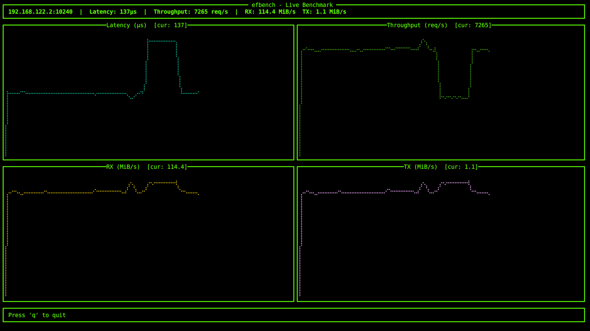
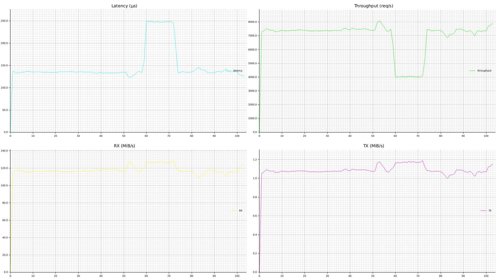

# efbench -- Benchmark tool for efense

Using eRPC to benchmark the network performance on these metrics:
 1. Latency: measure the round-trip time of a single request.
 2. Throughput: measure the number of requests that can be processed per
    second.
 3. Network bandwidth: measure the interface bytes sent and received per second.

## Server side

```bash
cargo run --bin efbench-server -- <SRV_IP> <SRV_PORT>
```


## Client side -- Live benchmark

TUI interface to display the benchmark results in real-time using run chart
for above metrics.

```bash
cargo run --bin efbench-client -- \
    live --iface eth1 --ip <SRV_IP> --port <SRV_PORT>
```



## Client side -- Plot mode

Run the benchmark and save the results to a file, then create plot PNG after
benchmark been stopped by `Ctrl-C` to stop the benchmark.

```bash
cargo run --bin efbench-client -- \
    plot --iface eth1 --ip <SRV_IP> --port <SRV_PORT>
```



